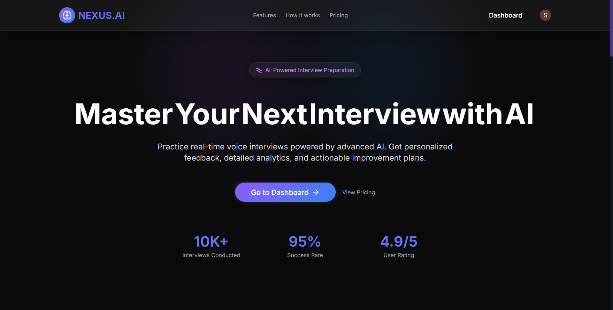
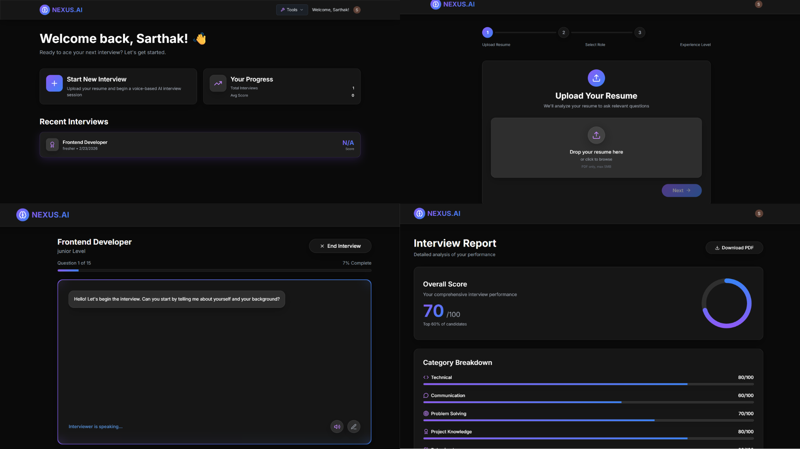
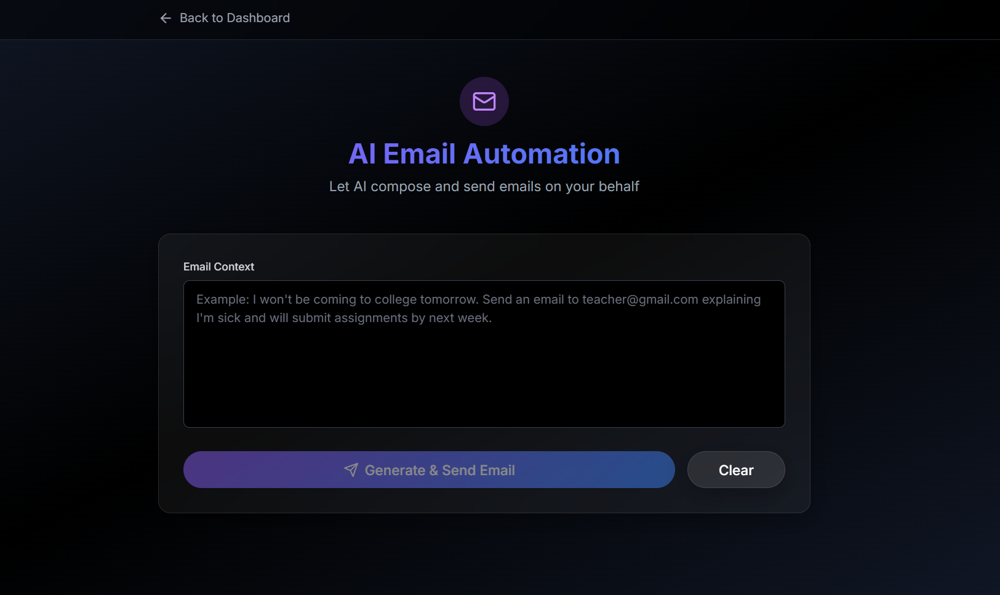

<div align="center">

<h1>🧠 NEXUS.AI</h1>
<h3>AI-Powered Interview Preparation Platform</h3>


**A web-based AI Interview Simulator with real-time voice conversation,  
resume-aware questioning, multi-LLM support, and stunning glassmorphism UI.**

[✨ Features](#-features) • [🏗 Architecture](#️-architecture) • [🚀 Quick Start](#-quick-start) • [📡 API Reference](#-api-reference) • [🤝 Contributing](#-contributing)

---

</div>

## ✨ Features

| Feature | Description |
|---|---|
| 🎙️ **Conversational Voice AI** | Real-time voice interviews powered by Deepgram STT + TTS (Stella voice) |
| 🤖 **Resume-Aware Questions** | AI extracts your skills and tailors every question to your background |
| 🧬 **Multi-LLM Backend** | Supports Groq (Llama 3.1), Claude, and Gemini models |
| 📊 **Smart Analytics** | Scores across Technical, Communication, Problem-Solving axes |
| 📄 **30-Day Action Plan** | Auto-generated personalized improvement roadmap |
| 🔐 **Secure Auth** | Clerk-powered authentication with JWT token verification |
| 💎 **Premium UI** | Glassmorphism dark theme with Aceternity UI effects |
| 🔄 **Auto-Flow Interview** | Silence detection → auto-stop → auto-transcribe, no buttons needed |

---

## 📸 Screenshots

### 🚀 Landing Page

<p align="center">
  
</p>

---

### 🎯 Interview Interface

<p align="center">
  
</p>

---

### 📧 Email Automation Page

<p align="center">
  
</p>

---

## 🏗️ Architecture

```
┌──────────────────────────────────────────────────────────┐
│                    NEXUS.AI Platform                     │
├────────────────┬───────────────────┬─────────────────────┤
│   Frontend     │     Backend       │    AI Service        │
│   React 18     │   Node.js 20      │   Python / FastAPI   │
│   Vite 5       │   Express 5       │   LangChain + Groq   │
│   Tailwind CSS │   MongoDB         │   Deepgram SDK       │
│   Clerk Auth   │   Clerk Auth      │   PyPDF2             │
│   Port: 5173   │   Port: 5000      │   Port: 8000         │
└────────────────┴───────────────────┴─────────────────────┘
          │                │                   │
          └────────────────┴───────────────────┘
                     HTTP / REST API
```

### Request Flow

```
User (Browser) ──► Frontend (React)
                        │
                        ├──► Backend /api/resume     ──► MongoDB
                        ├──► Backend /api/interview  ──► AI Service (FastAPI)
                        ├──► Backend /api/transcribe ──► Deepgram STT
                        └──► Backend /api/speak      ──► Deepgram TTS
```

---

## 📁 Project Structure

```
nexus-ai/
├── 📂 frontend/                    # React + Vite SPA
│   ├── src/
│   │   ├── components/
│   │   │   ├── aceternity/         # AuroraBackground, MovingBorder, SpotlightCard...
│   │   │   ├── common/             # GlassCard, Loader, FileUpload
│   │   │   ├── sections/           # PricingSection
│   │   │   └── ui/                 # shadcn/ui (Button, Card, Input...)
│   │   ├── hooks/
│   │   │   ├── useConversationalRecorder.js  # Auto-flow: silence detect + transcribe
│   │   │   ├── useThaliaSpeech.js            # Deepgram TTS hook
│   │   │   └── useAudioRecorder.js           # MediaRecorder wrapper
│   │   ├── pages/
│   │   │   ├── Landing.jsx         # Public landing page
│   │   │   ├── Dashboard.jsx       # User dashboard
│   │   │   ├── InterviewSetup.jsx  # Resume upload + role selection
│   │   │   ├── InterviewSession.jsx# Live interview (conversational)
│   │   │   └── Report.jsx          # Post-interview analytics
│   │   ├── services/               # Axios API clients
│   │   ├── store/                  # Zustand global state
│   │   └── utils/
│   └── package.json
│
├── 📂 backend/                     # Node.js Express API
│   ├── src/
│   │   ├── controllers/
│   │   │   ├── interview.controller.js
│   │   │   ├── transcription.controller.js   # Deepgram STT
│   │   │   ├── tts.controller.js             # Deepgram TTS (Stella)
│   │   │   ├── resume.controller.js
│   │   │   └── report.controller.js
│   │   ├── routes/                 # Express routers
│   │   ├── models/                 # Mongoose schemas
│   │   ├── middleware/             # Clerk auth, Multer upload
│   │   ├── services/
│   │   │   ├── deepgramService.js  # STT + TTS integration
│   │   │   ├── aiService.js        # FastAPI bridge
│   │   │   └── claudeService.js
│   │   └── server.js
│   └── package.json
│
├── 📂 ai-service/                  # Python FastAPI AI Engine
│   ├── app/
│   │   ├── routers/
│   │   │   ├── interview.py        # Conversation generation
│   │   │   ├── resume.py           # PDF parsing
│   │   │   └── report.py           # Analytics generation
│   │   ├── services/
│   │   │   ├── interview_engine.py # LangChain conversation
│   │   │   ├── resume_parser.py    # PyPDF2 + AI extraction
│   │   │   └── report_generator.py # Scoring + action plan
│   │   ├── models/                 # Pydantic schemas
│   │   ├── utils/
│   │   │   └── llm_client.py       # Groq / Claude / Gemini router
│   │   ├── config.py
│   │   └── main.py
│   └── requirements.txt
│
├── README.md
└── SETUP.md
```

---

## 🚀 Quick Start

### Prerequisites

| Requirement | Version | Notes |
|---|---|---|
| Node.js | `18+` | For frontend and backend |
| Python | `3.9+` | For AI service |
| MongoDB | `6+` | Local or Atlas |
| Clerk Account | — | [clerk.com](https://clerk.com) — free tier |
| Groq API Key | — | [console.groq.com](https://console.groq.com) — free |
| Deepgram API Key | — | [deepgram.com](https://deepgram.com) — for voice |

---

### 1. Clone the Repository

```bash
git clone https://github.com/Phoenix-91/Nexus_AI.git
cd Nexus_AI
```

### 2. Install Dependencies

```bash
# Frontend
cd frontend && npm install

# Backend
cd ../backend && npm install

# AI Service
cd ../ai-service && pip install -r requirements.txt
```

### 3. Configure Environment Variables

**`frontend/.env`**
```env
VITE_API_URL=http://localhost:5000/api
VITE_CLERK_PUBLISHABLE_KEY=pk_test_your_clerk_publishable_key
```

**`backend/.env`**
```env
PORT=5000
MONGODB_URI=mongodb://localhost:27017/nexusai
CLERK_SECRET_KEY=sk_test_your_clerk_secret_key
DEEPGRAM_API_KEY=your_deepgram_api_key
PYTHON_AI_SERVICE_URL=http://localhost:8000
```

**`ai-service/.env`**
```env
GROQ_API_KEY=your_groq_api_key
```

### 4. Start All Services

Open **3 separate terminals**:

```bash
# Terminal 1 — AI Service
cd ai-service
py -m uvicorn app.main:app --reload --port 8000
```

```bash
# Terminal 2 — Backend
cd backend
npm run dev
```

```bash
# Terminal 3 — Frontend
cd frontend
npm run dev
```

Open **http://localhost:5173** in Chrome or Edge.

---

## 🎯 Usage

### Interview Flow

```
1. Sign Up / Login  →  Clerk authentication
         │
2. Upload Resume    →  PDF, max 5MB, auto-parsed by AI
         │
3. Select Role      →  Frontend / Backend / Full Stack / ML / DevOps...
         │
4. Live Interview   →  Voice conversation, fully automatic:
         │               AI speaks question
         │               Mic auto-starts (600ms delay)
         │               Silence detected → auto-stops (4s)
         │               Transcribed → sent to AI → next question
         │
5. View Report      →  Scores, strengths, weaknesses, 30-day plan
```

---

## 📡 API Reference

### Backend REST API — `http://localhost:5000/api`

#### Resume

| Method | Endpoint | Description |
|--------|----------|-------------|
| `POST` | `/resume/upload` | Upload PDF resume |
| `GET` | `/resume/:userId` | Get parsed resume |

#### Interview

| Method | Endpoint | Description |
|--------|----------|-------------|
| `POST` | `/interview/start` | Create interview session |
| `POST` | `/interview/:id/message` | Send answer, get next question |
| `POST` | `/interview/:id/end` | End session |

#### Voice

| Method | Endpoint | Description |
|--------|----------|-------------|
| `POST` | `/transcribe` | Transcribe audio (Deepgram STT) |
| `POST` | `/speak` | Text-to-speech (Deepgram Stella) |

#### Report

| Method | Endpoint | Description |
|--------|----------|-------------|
| `GET` | `/report/:sessionId` | Get full interview report |

---

### AI Service — `http://localhost:8000`

| Method | Endpoint | Description |
|--------|----------|-------------|
| `POST` | `/interview/start` | Generate opening question |
| `POST` | `/interview/message` | Process answer, return next question |
| `POST` | `/resume/parse` | Extract resume structure |
| `POST` | `/report/generate` | Generate analytics + action plan |

---

## 🛠️ Tech Stack

### Frontend
| Technology | Purpose |
|---|---|
| React 18 + Vite 5 | SPA framework |
| Tailwind CSS | Utility-first styling |
| shadcn/ui | Accessible component primitives |
| Aceternity UI | AuroraBackground, MovingBorder, SpotlightCard |
| Zustand | Lightweight global state |
| Clerk | Authentication UI |
| Axios | HTTP client |

### Backend
| Technology | Purpose |
|---|---|
| Express.js 5 | REST API framework |
| MongoDB + Mongoose | Document database |
| Clerk SDK | JWT token verification |
| Multer | Resume file uploads |
| Deepgram SDK | Speech-to-text + Text-to-speech |
| Helmet.js | Security headers |

### AI Service
| Technology | Purpose |
|---|---|
| FastAPI | High-performance Python API |
| LangChain | Conversation chain management |
| Groq (Llama 3.1 70B) | Primary LLM |
| PyPDF2 | Resume PDF parsing |
| Pydantic | Schema validation |

---

## 🔒 Security

- **Authentication**: Clerk JWT on every protected route
- **Headers**: Helmet.js (CSP, XSS, HSTS)
- **CORS**: Configured per environment
- **Uploads**: PDF-only, 5MB max, sandboxed `/uploads` directory
- **Secrets**: All API keys in `.env`, excluded from git

---

## 🌐 Browser Compatibility

| Browser | Voice Support | Notes |
|---|---|---|
| Chrome 90+ | ✅ Full | **Recommended** |
| Edge 90+ | ✅ Full | **Recommended** |
| Firefox | ⚠️ Partial | Deepgram TTS works, STT limited |
| Safari | ⚠️ Partial | WebRTC constraints differ |

---

## 🤝 Contributing

Contributions are welcome!

```bash
# 1. Fork the repo
# 2. Create your branch
git checkout -b feature/your-feature-name

# 3. Commit your changes
git commit -m "feat: add your feature"

# 4. Push and open a PR
git push origin feature/your-feature-name
```

Please follow [Conventional Commits](https://www.conventionalcommits.org/) for commit messages.

---

## 📝 License

Distributed under the **MIT License**. See [`LICENSE`](LICENSE) for more information.

---

<div align="center">

Made with ❤️ by **Phoenix-91**

⭐ Star this repo if you found it useful!

</div>
